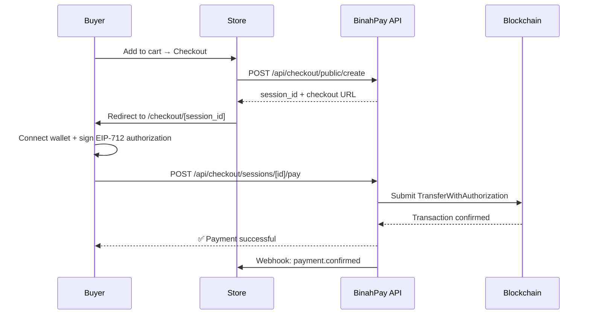

<p align="center">
  
  
  
  
  
</p>

# BinahPay

**Accept crypto payments in minutes, not months.** BinahPay is a full-stack payments gateway built on the [x402 protocol](https://x402.org) that lets merchants — small shops, creators, SaaS platforms, and event organizers — accept USDC payments on Base with zero blockchain expertise.

> Buyers sign payments client-side. The x402 facilitator handles on-chain settlement.  
> Sellers get a dashboard, shareable payment links, and an embeddable checkout — all non-custodial.

---

## ✨ Features

| Feature | Description |
|---|---|
| **Merchant Dashboard** | Revenue analytics, recent payments, transaction history, and CSV export |
| **Online Store Builder** | Create a public storefront with products, categories, and cart checkout |
| **Payment Links** | Generate shareable pay-links with QR codes for any amount |
| **Embeddable Checkout** | Drop-in `<EmbeddedCheckout />` component for any React app |
| **Checkout Sessions API** | Stripe-like session-based checkout flow for custom integrations |
| **Webhooks** | HMAC-verified event notifications for payment confirmations |
| **Testnet / Mainnet Toggle** | Switch between Base Sepolia and Base Mainnet per project |
| **Privy Auth** | Email + wallet login with automatic onboarding flow |
| **Point of Sale** | In-person payment screen for physical retail |
| **SDK Packages** | `@binahpay/checkout`, `@binahpay/client`, `@binahpay/server` |

---

## 🏗 Architecture

```
┌──────────────────────────────────────────────────────┐
│                    Next.js 16 App                    │
├────────────┬────────────────┬────────────────────────┤
│  Dashboard │  Public Store  │  Checkout Experience   │
│  /dashboard│  /s/[slug]     │  /checkout/[session_id]│
├────────────┴────────────────┴────────────────────────┤
│                   API Routes (/api)                  │
│  checkout · payment-links · products · stores ·      │
│  webhooks · dashboard · auth · projects              │
├──────────────────────────────────────────────────────┤
│  Privy Auth  │  wagmi/viem  │  x402 Facilitator      │
├──────────────┴──────────────┴────────────────────────┤
│           Neon Serverless PostgreSQL                 │
└──────────────────────────────────────────────────────┘
```

---

## 🚀 Quick Start

### Prerequisites

- **Node.js** ≥ 18
- **pnpm** ≥ 10
- A **Neon** PostgreSQL database (or any Postgres instance)
- **Privy** app ID and secret ([privy.io](https://privy.io))
- **Reown** (WalletConnect) project ID ([cloud.reown.com](https://cloud.reown.com))

### 1. Clone & Install

```bash
git clone https://github.com/CaptSinBad/x402-wrapper.git
cd x402-wrapper
pnpm install
```

### 2. Configure Environment

Copy the example env file and fill in your values:

```bash
cp .env.server .env.local
```

| Variable | Description |
|---|---|
| `DATABASE_URL` | Neon Postgres connection string |
| `NEXT_PUBLIC_PRIVY_APP_ID` | Privy application ID |
| `PRIVY_APP_SECRET` | Privy server-side secret |
| `NEXT_PUBLIC_REOWN_PROJECT_ID` | WalletConnect / Reown project ID |
| `NEXT_PUBLIC_APP_URL` | Your app's public URL |
| `COINBASE_API_KEY_NAME` | *(optional)* Coinbase CDP API key |
| `COINBASE_API_KEY_PRIVATE_KEY` | *(optional)* Coinbase CDP private key |

### 3. Run Migrations

```bash
pnpm migrate
```

### 4. Start Development Server

```bash
pnpm dev
```

Open [http://localhost:3000](http://localhost:3000) and sign up to create your first project.

---

## 📂 Project Structure

```
x402-wrapper/
├── app/
│   ├── api/              # 40+ API routes
│   │   ├── checkout/     # Session-based checkout
│   │   ├── payment-links/# Payment link CRUD
│   │   ├── products/     # Product management
│   │   ├── stores/       # Store management
│   │   ├── webhooks/     # Webhook subscriptions
│   │   └── dashboard/    # Dashboard data APIs
│   ├── checkout/         # Checkout UI + components
│   ├── dashboard/        # Merchant dashboard pages
│   ├── s/[slug]/         # Public storefront
│   ├── link/[token]/     # Payment link pages
│   ├── pos/              # Point of sale
│   └── components/       # Shared UI components
├── sdk/
│   ├── checkout/         # @binahpay/checkout (embeddable)
│   ├── client/           # @binahpay/client (browser SDK)
│   └── server/           # @binahpay/server (Node SDK)
├── core/
│   └── facilitator/      # x402 facilitator config
├── db/
│   ├── schema.sql        # Base schema
│   └── migrations/       # 16 migration files
├── lib/                  # Auth, DB, utilities
├── docs/                 # Technical guides & docs
├── scripts/              # CLI tools & migrations
└── tests/                # Vitest test suite
```

---

## 💳 Payment Flow



---

## 🧪 Testing

```bash
# Unit & integration tests
pnpm test

# Run with local Postgres
pnpm test:integration
```

---

## 🐳 Docker

```bash
# Full stack with Postgres
docker compose up

# Clean environment
docker compose -f docker-compose.clean.yml up
```

---

## 📦 SDK Usage

### Checkout Sessions (Server-side)

```typescript
import { BinahPay } from '@binahpay/server';

const binahpay = new BinahPay({ apiKey: 'your-api-key' });

const session = await binahpay.checkout.sessions.create({
  line_items: [
    { price_id: 'prod_123', quantity: 1 }
  ],
  success_url: 'https://yoursite.com/success',
  cancel_url: 'https://yoursite.com/cancel',
});
```

### Embeddable Checkout (Client-side)

```tsx
import { EmbeddedCheckout } from '@binahpay/checkout';

<EmbeddedCheckout
  sessionId="sess_abc123"
  onSuccess={(session, txHash) => console.log('Paid!', txHash)}
  onError={(error) => console.error(error)}
/>
```

---

## 🔗 API Reference

| Endpoint | Method | Description |
|---|---|---|
| `/api/checkout/public/create` | POST | Create checkout session (no auth) |
| `/api/checkout/sessions/[id]` | GET | Get session details |
| `/api/checkout/sessions/[id]/pay` | POST | Submit payment |
| `/api/payment-links/create` | POST | Create payment link |
| `/api/payment-links/list` | GET | List payment links |
| `/api/products/list` | GET | List products |
| `/api/products/[id]` | GET/PUT/DELETE | Manage products |
| `/api/stores/create` | POST | Create store |
| `/api/stores/public/[slug]` | GET | Get public store data |
| `/api/webhooks/subscriptions` | GET/POST | Manage webhook subscriptions |
| `/api/dashboard/stats` | GET | Dashboard analytics |
| `/api/dashboard/recent-payments` | GET | Recent transactions |
| `/api/projects/network` | GET/PATCH | Toggle testnet/mainnet |

Full API documentation available in [`docs/api-reference.md`](docs/api-reference.md).

---

## 🌐 Deployment

BinahPay is optimized for **Vercel** with **Neon** serverless Postgres:

1. Push to GitHub
2. Import project in [Vercel](https://vercel.com)
3. Set environment variables
4. Deploy — migrations run automatically

See [`docs/deploy/`](docs/deploy/) for detailed deployment guides.

---

## 🛣 Roadmap

- [x] USDC payments on Base
- [x] Merchant dashboard with analytics
- [x] Online store builder
- [x] Payment links with QR codes
- [x] Embeddable checkout SDK
- [x] Webhook notifications
- [x] Testnet/Mainnet toggle
- [ ] Naira (NGN) on/off-ramp payments
- [ ] Multi-currency support
- [ ] Email receipts
- [ ] Subscription / recurring payments
- [ ] Mobile app

---

## 🤝 Contributing

Contributions are welcome! Please read the existing codebase patterns and open a PR.

```bash
# Fork → Clone → Branch → Code → Test → PR
git checkout -b feature/my-feature
pnpm test
git push origin feature/my-feature
```

---

## 📄 License

MIT — see [LICENSE](LICENSE) for details.

---

<p align="center">
  Built with ❤️ on <a href="https://base.org">Base</a> · Powered by <a href="https://x402.org">x402</a>
</p>
